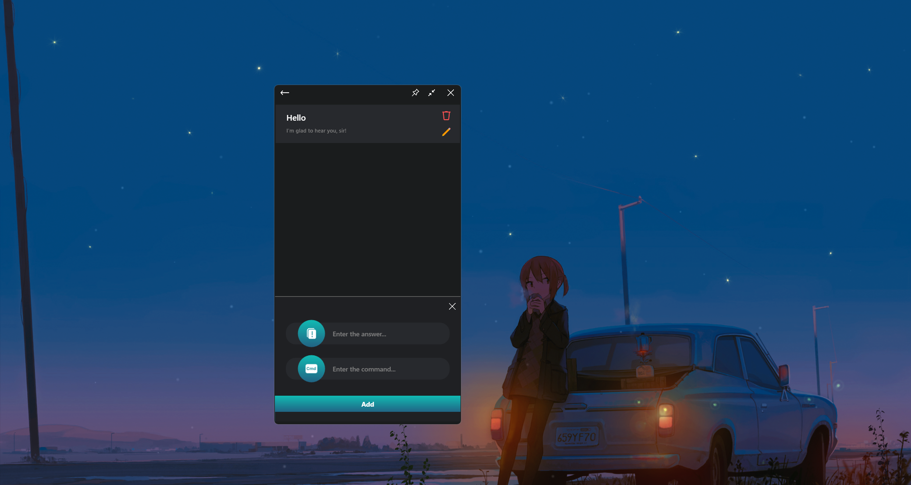

# Описание проекта "Voice Manager":

## Языки
- [English](./README.md)
- [Українська](./README_UA.md)
- [Русский](./README_RU.md)

**"Voice Manager"** - это проект приложения, предназначенного для удобного использования компьютера с помощью голосовых команд, разработанный с использованием **WPF .NET Core**. Оно предоставляет пользователю возможность:
- Запускать приложения, открывать файлы; 
- Открывать ссылки в браузере по умолчанию;
- Выполнять голосовой поиск;
- Отображать встречные сообщения на команды пользователя.

Историю ваших запросов и ответов "Ассистента" можно наблюдать в виде чата на главной странице приложения.
Команды доступны в двух вариантах: **голосом** для выбранной голосовой модели в разделе ***"Дополнительные настройки "*** или **написав команду** вручную на клавиатуре в поле ввода сообщения.

## Открытие файлов, запуск приложений:

Чтобы добавить новую команду для открытия файла, необходимо:

Перейти в меню, нажав на кнопку в левом верхнем углу -> Выбрать раздел ***"Управление файлами "*** -> Нажать на кнопку внизу ***"Добавить новый элемент "***.

Затем нужно нажать на кнопку с изображением файла и выбрать путь к нужному файлу с помощью диалога файлов, путь будет отображен на панели вверху, на панели внизу нужно написать команду, которая будет действовать как **"триггер "** для открытия файла, затем нужно просто нажать на кнопку ***"Добавить "***.

## Открытие ссылок в браузере по умолчанию:

Процедура добавления команды для открытия сайта по ссылке аналогична добавлению команды для открытия файла. 

Перейдите в меню, нажав на кнопку в левом верхнем углу -> Выберите раздел ***"Управление сайтом "*** -> Нажмите на кнопку внизу ***"Добавить новый элемент "***.
Единственное отличие - это данные, которые указываются для создания триггера.

## Отображение контрсообщений к командам пользователя:

Добавление новой команды для вывода сообщения в ответ на команду пользователя аналогично двум предыдущим процедурам.

Перейдите в меню, нажав на кнопку в левом верхнем углу -> Выберите раздел ***"Управление ответами "*** -> Нажмите кнопку внизу ***"Добавить новый элемент "***.

## Голосовой поиск:
Когда после запроса пользователя среди **"триггеров "** не будет найдено ни одного совпадения, команда будет воспринята как запрос на поиск в Интернете.

## Заключение
Подводя итог, можно сказать, что Voice Manager обеспечивает интуитивно понятный интерфейс и некоторые удобства при работе за компьютером.
