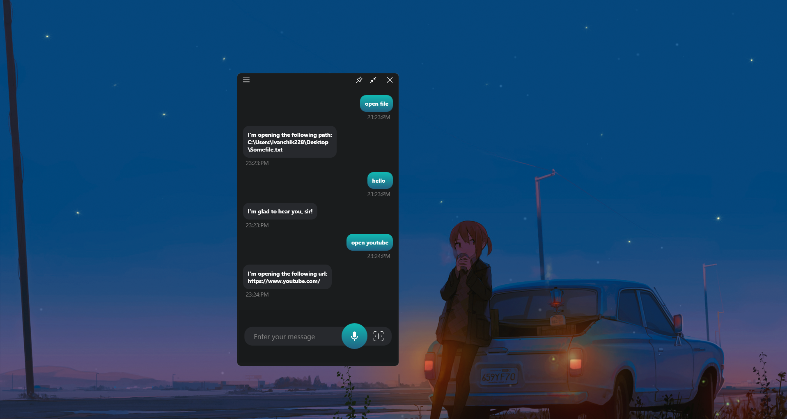
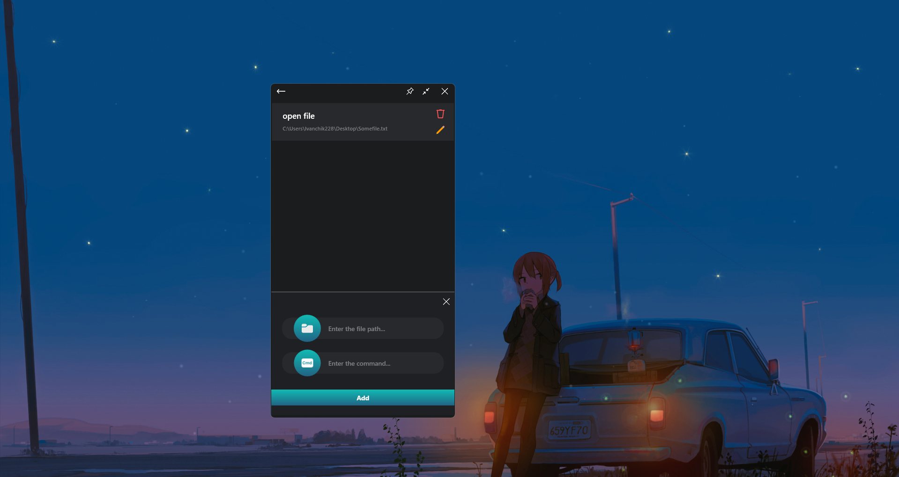
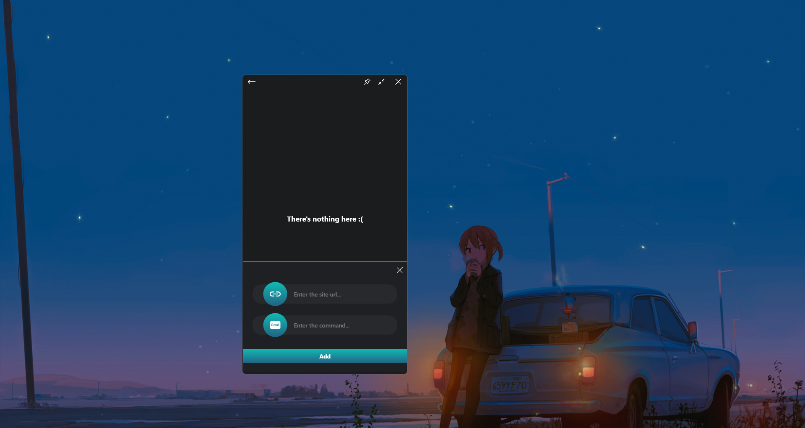
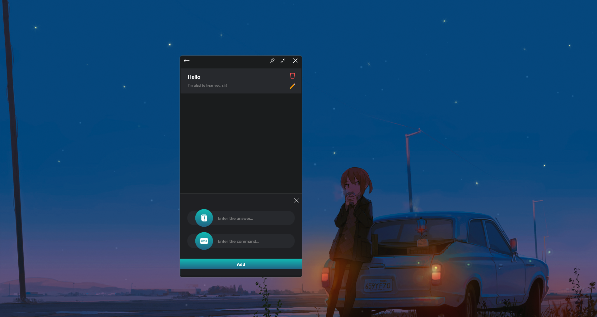

# Опис проекту "Voice Manager":

## Мови
- [English](./README.md)
- [Русский](./README_RU.md)
- [Українська](./README_UA.md)

Проект **"Voice manager"** - це додаток, призначений для зручного користування комп'ютером за допомогою голосових команд, розроблений з використанням **WPF .NET Core**. Він надає користувачеві можливість
- Запускати програми, відкривати файли; 
- Відкривати посилання в браузері за замовчуванням;
- Здійснювати голосовий пошук;
- Відображати контр-повідомлення на команди користувача.

Історію своїх запитів і відповідей "Асистента" можна спостерігати у вигляді чату на головній сторінці програми.
Команди доступні двома способами: **голосом** для обраної голосової моделі в розділі ***"Додаткові налаштування "*** або **вручну написавши команду** на клавіатурі в полі введення повідомлення.

## Відкриття файлів, запуск програм:

Щоб додати нову команду для відкриття файлу, потрібно:

Перейти в меню, натиснувши кнопку в лівому верхньому кутку -> Вибрати розділ ***"Керування файлами "*** -> Натиснути кнопку внизу ***"Додати новий пункт "***.

Далі потрібно натиснути на кнопку із зображенням файлу, і вибрати шлях до потрібного файлу за допомогою файлового діалогу, шлях відобразиться в панелі вище, в панелі нижче потрібно написати команду, яка буде виступати в якості **"тригера "** для відкриття файлу, після чого потрібно просто натиснути на кнопку ***"Додати "***.

## Відкриття посилань в браузері за замовчуванням:

Процедура додавання команди для відкриття сайту за посиланням аналогічна додаванню команди для відкриття файлу. 

Перейдіть в меню, натиснувши кнопку в лівому верхньому кутку -> Виберіть розділ ***"Управління сайтом "*** -> Натисніть кнопку внизу ***"Додати новий пункт "***.
Різниця лише в даних, які вказуються для створення тригера.

## Відображення контр-повідомлень на команди користувача:

Додавання нової команди для виведення повідомлення у відповідь користувачеві відбувається аналогічно до двох попередніх процедур.

Перейдіть до меню, натиснувши кнопку у верхньому лівому кутку -> Виберіть розділ ***"Керування відповідями "*** -> Натисніть кнопку внизу ***"Додати новий елемент "***.

## Голосовий пошук:
Якщо після запиту користувача не було знайдено збігу серед **"тригерів "**, команда буде сприйнята як пошуковий запит в Інтернеті.

## Висновок
Підводячи підсумок, можна сказати, що Voice Manager має інтуїтивно зрозумілий інтерфейс і додає певні зручності в роботі за комп'ютером.
